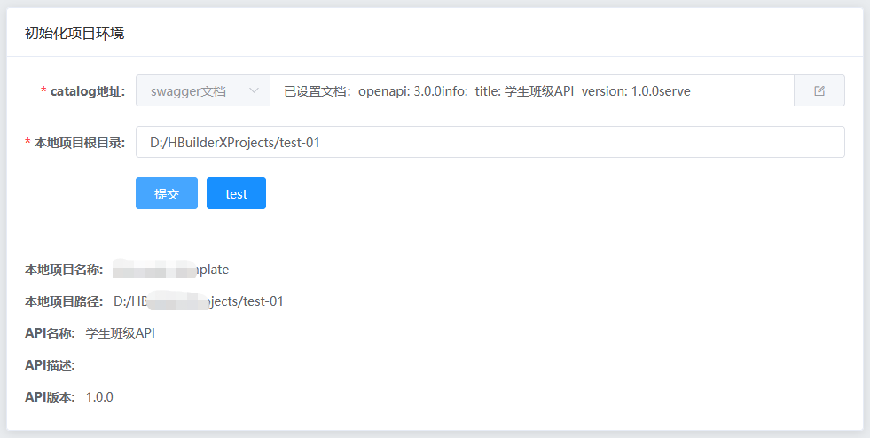
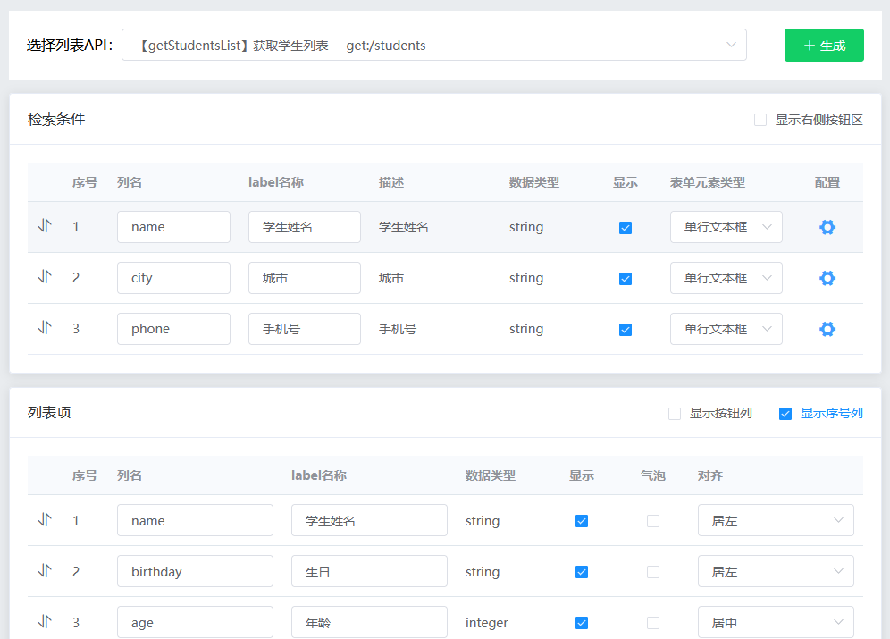
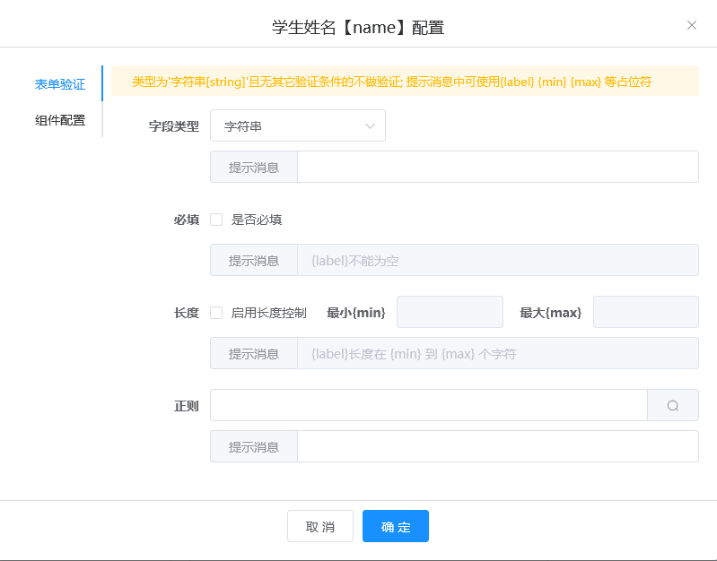
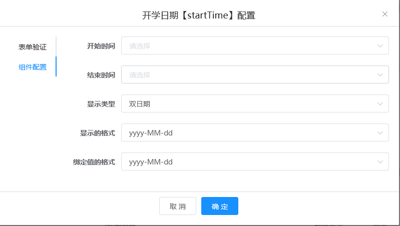

# 基于 swagger 的 VUE 代码生成器

根据 Swagger 文档定义，自动生成视图页面、API、路由、mock 等。新页面可热更新直接运行。根据目标项目根目录（工作空间）中的 ESLint 环境配置信息，对文件进行 --fix 修复，保障文件代码格式与目标项目统一。

## 主要功能

- 支持 Swagger 文件数据及目标项目数据离线缓存，无需重复初始化项目；
- 支持按需自动注入、注册自定义组件；
- API 文件支持按需增量更新，自动按需引入依赖函数，no never-used; （Tips:需框架及配套组件支持）
- 路由文件支持新增一级路由，自动合并二级路由（依据 swagger tag 分组）；开启路由分组后支持将路由按 tag 分割成子路由文件；（Tips:目前仅适配了 vue 的路由模式）
- 采用 art-template 字符串模板引擎，简单易用，并使用自定义规则解决与 Vue、ES5 模板语法冲突问题；
- 支持自动匹配列名与列描述信息，并根据字段类型尝试自动匹配 input-form-item
- 支持自定义模板与模板数据（内置多种常用数据及格式）；支持配置默认模板；（Tips:需框架及配套组件支持）
- 支持配置同名文件存在时，自动覆盖或跳过，默认页面文件自动覆盖，路由及 API 自动跳过；
- 支持配置自动生成的页面、目录、API 的文件名后缀连接符，例如：列表页默认为 filename-[list].vue，并且默认过滤文件名中的 (^query|list$)（可选，强迫症患者福音）
- 支持配置列表字段默认对齐方式，默认数值型居中，其它类型居左；
- 支持配置表单元素在各类型模板中是否可用【boolean | 正则：'list|form'】
- 支持字典数据（Tips:需框架及配套组件支持）；
- 支持设置不参与用户交互的参数列表，例如：每页条数，当前页码等；
- 支持自动识别匹配复合组件，例如双日历组件 data[Time]Range，同时支持手动配置，并高亮显示匹配关系；（Tips:其中包含配套的自定义组件）

## 安装说明

1.  克隆或下载项目

```
https://gitee.com/rwx666888/create-page-common/repository/archive/dev.zip
或
git clone https://gitee.com/rwx666888/create-page-common.git
```

2.  进入目录 create-page-common/server; 初始化项目

```
// 进入目录
cd create-page-common/server
// 初始化项目
npm i
```

3. 启动服务，访问地址查看控制台输出，默认为： localhost:3000

```
npm run vue2
```

启动脚本与模板对应关系
> vue2 : vue2 + element-ui
> vue3 : vue3 + element-plus
## 使用说明

[开发文档](./web-project/README.md)
<br>
[体验 demo](https://lianglei.site/)

1. 初始化项目
   填写 swagger 或 catalog 项目地址（格式如下图）、和本地目标项目根路径；初始化项目，成功后返回项目及接口信息，检查信息是否有误！
   
2. 生成页面
   选择需要生成的页面对应的接口 API，按需修改下方配置项目后，点击【生成】按钮，批量生成相关页面；如果目标项目服务已启动，此时可直接访问新页面；
   

> Tips: 列表 API 下拉框中只展示包含 list 的 API;

> 拖动检索条件、列表项区域中的图标（ ），可改变字段显示顺序；

> 列表项 -> 气泡：对应 show-overflow-tooltip ，暂不支持 table-header 使用气泡；

> 列表项 -> 显示：设置是否在列表中显示该字段；

## 配置
> 配置文件在 server/create_cfg_tmpl/**/config/ 目录下; 模板文件在server/create_cfg_tmpl/**/template/ 目录下;

> <font color="red">注意：修改配置文件后，需要在 server 目录下重启 npm run vue2 服务；并且刷新页面（ctrl + F5, 强制刷新浏览器缓存，或开启开发者模式中的禁用缓存）才能生效；</font>

> 注意：web-project/public/tmpl_cfg 及 server/www/tmpl_cfg 目录下的配置文件及模板均为临时文件，修改无效，npm run xx 启动时，这部分会被 server/create_cfg_tmpl 中与 xx 匹配的文件完全覆盖；

以下为配置文件部分示例，详细请查看 server/create_cfg_tmpl/\*\*/config/config.js

```
{
  // 分页参数，例如每页条数，当前页码等非用户输入的参数
  pageListParams: [
    'pageSize', 'currentPage'
  ],
  makeFile: { // 生成文件的配置
    isMakeView: true, // 是否生成视图文件
    isMakeApi: true, // 是否生成api文件
    isMakeRouter: true, // 是否生成路由文件
    isMakeMock: false, // 是否生成mock数据文件
    useRouterGroup: false // 是否启用路由分组，启用后，将会生成子路由文件，例如：src/router/park/user.js ,存储路径由 template.routerFile.savePath 决定, 文件后缀名始终与主路由文件一致
  },
  /**
   * 缓存配置
   * 目前只项目、api、版本三个维度同时匹配才会返回缓存数据，场景为：本次小迭代周内，不考虑历史版本的数据变更
   */
  cache: {
    disabled: true // 是否禁用缓存
  },
  author: 'lianglei-2-1', // 作者
  reWrite: { // 存在重名文件是否直接覆盖， true：覆盖； false：跳过; key值需与 template 中的key值一致,未设置的文件默认为true;
    listPage: true, // 列表页
    infoPage: true, // 详情页
    formPage: true // 表单页
  },
  listPage: { // 列表页 表格列对齐方式
    colAlignDefault: 'left', // 默认居左对齐
    colAlignInt: 'center' // 数字型默认居中对齐
  },
  // 项目文件结构路径配置
  projectPath: {
    apisFilePath: 'src/apis', // api文件目录
    httpFile: '@/apis/request.js', // 网络请求库，例如 axios；必须 export 导出 （post get del put）方法
    routerFile: 'src/router/index.js', // 路由文件
    routerMatchMark: '@/views/' // 路由文件中路由匹配标记, 可匹配路由文件中 component: () => import('@/views/icons/index'), 的 @/views/部分，
  },
  // 生成文件的配置, 其中base开头的为基础模板配置，不可修改属性名称
  template: {
    listPage: { // 列表页
      savePath: 'src/views', // 生成的位置目录 相对于项目根目录的路径， 例如： src/views
      suffix: '-list',
      dirSuffix: '-page', // 视图目录后缀连接词, 例如 /user-page
      template: 'page/list-page.art' // 模板名称 相对于 /create_cfg_tmpl/*/template 目录
    },
    infoPage: { // 详情页
      savePath: 'src/views', // 生成的位置目录 相对于项目根目录的路径， 例如： src/views
      suffix: '-info',
      dirSuffix: '-page', // 视图目录后缀连接词, 例如 /user-page
      template: 'page/info-page.art' // 模板名称 相对于 /create_cfg_tmpl/*/template 目录
    },
    routerFile: { // 路由文件；名称不可修改; 暂不支持外部多路由文件，只支持单路由文件，也不支持路由的命名视图、动态加载等
      template: 'base/base-router.art', // 模板名称 相对于 /create_cfg_tmpl/*/template 目录
      templateLayout: 'base/base-router-layout.art',
      savePath: './park' // 路由分组文件保存目录，相对于主路由文件的路径 ，例如 projectPath.routerFile， 仅当 projectPath.useRouterGroup 为true时生效
    },
    baseMockData: { // mock数据 baseMockData 名称不可修改
      savePath: 'mock/json', // 生成的位置目录 相对于项目根目录 /mock/json/data
      templateLayout: 'base/base-mock-layout.art', // 模板名称 相对于 /create_cfg_tmpl/*/template 目录
      template: 'base/base-mock-item.art' // 模板名称 相对于 /create_cfg_tmpl/*/template 目录
    }
    ......
  },
  // mock数据配置
  mockCig: {
    // 模式数据类型映射
    columnTypeMap: {
      /**
       * 同正则匹配字段名称，从而返回猜测类型的数据，预设的数据在/mock/json/data/example-data.js 文件中 makeDemoMockData
       * 匹配不到的所有模拟字段均返回 makeDemoMockData.randomStr 即1-5位随机字符
       * 同一类型均有数量限制，限制为makeDemoMockData中key的后缀最大值：超过数量上限后返回随机数；
       * 例如： name1:XX; name2:xx; 则name类型最多可用3次，可用增加次数，例如name3\name4，但后缀必须是同前缀分组下的连续的整数；
       * 这里的key对应 /mock/json/data/example-data.js 文件中 makeDemoMockData 对象的key 的前缀
       * 属性值只支持 正则表达式 或 false
       * 生成器中使用了 Object.assign 对配置信息进行合并，所以可随意扩展，如果想禁用预设字段的映射，将对应key值设置为false,例如： name:false
       * 注意后续版本中可能会移除预设的映射规则
       */
      integer: /integer/,
      name: /(title|name$)/i,
      city: /(^city|city$)/i,
      province: /(^province|province$)/i,
      email: /email/i,
      uid: /(code|id)/i,
      datetime: /(^datetime|datetime$)/i,
      date: /(^date|date$)|birthday/i,
      phone: /(^(phone|mobile)|(phone|mobile)$)/i,
      demoSex: /sex/i, // 演示demo数据
      demoEdu: /edu/i // 演示demo数据
    }
  },
  // 表单元素配置
  formItemCig: {
    dataTimeRangeRegExp: '^(start|end|begin)|(start|end|begin)$', // 不区分大小写
    isStartRegExp: '^(start|begin)|(start|begin)$' // 不区分大小写
  },
  /**
   * 路由前缀连接词
   * 可为空，如果设置则必须首字母大写，否则可能导致路由缓存不生效；
   * 用于构造 路由中的 name，及页面中 export default.name
   * 最终格式为： [lever2]xxxx ,例如：PageUserList, 其中page 为lever2路由前缀连接词，UserList为API名称
   * 详见 /mock/json/createPage.js
   */
  routerSuffix: {
    lever1: 'Menu',
    lever2: 'Page'
  },
  /**
   * 表单元素类型
   * disabled : 在构造模板中，不可使用（暂不支持）的元素
   *   [undefined] : 不禁用, 默认值;
   *   [boolean] true : 全部禁用;
   *   [string] 只有完全匹配的才禁用，例如：'list|form' 则表示为 list 或 form 禁用;
   * path : 可选，自定义组件的路径 例如：'@/components/cusDatePicker/index.vue'
   * valid : 必须，表单验证配置
   *  -- trigger: 必须，触发方式 'blur' 、'change' 等
   *  -- type: 可选，数据类型 'string'(默认)、'date'、'array' 等
   * dataSource : 可选，数据源配置，例如：下拉选择框的选项
   *  -- dataType: 必须，数据格式，默认array，可选：array、object
   *  -- default: 可选，数据源默认值，例如：下拉选择框的默认值 [{value: null, label: '全部'}] ; 如果没有对组件进行配置，则使用默认值
   */
  formItemOpts: [
    {
      value: 'input',
      label: '单行文本框',
      valid: {
        trigger: 'blur'
      }
    },
    {
      value: 'checkboxGroup',
      label: '多选框组',
      valid: {
        trigger: 'change',
        type: 'array'
      },
      dataSource: {
        dataType: 'array',
        default: [ { value: '-1', label: '选项一' }, { value: '-2', label: '选项二' } ]
      }
    },
    {
      value: 'datePicker',
      label: '日期选择器',
      valid: {
        trigger: 'change',
        type: 'date'
      }
    },
    {
      value: 'cusDatePicker',
      label: '日期选择器（双）',
      path: '@/components/cusDatePicker/index.vue',
      valid: {
        trigger: 'change',
        type: 'date'
      }
    }
    ......
  ],
  formFieldDetection: { // 根据字段名称及类型尝试匹配表单元素类型，处理方法在 mixins/create.js -> formItemTypeChoice方法中
    findDate: true, // 是否检测日期，并适配为日期组件
    findArray: true // 是否检测数组，并适配为下拉多选框
  }
}

```

## 预设模板变量

> 模板文件在 server/create_cfg_tmpl 目录下; 注意：web-project/public/tmpl_cfg 及 server/www/tmpl_cfg 目录下的模板均为临时文件，修改无效，npm run xx 启动时，这部分会被 server/create_cfg_tmpl 中与 xx 匹配的文件完全覆盖；

> 预设模板变量不可直接修改，只能扩展，或通过配置文件修改；

### 路由

```
{
  path: '/${{lever1Path}}',
  component: Layout,
  name:'${{lever1RouterName}}',
  meta: {
    title: '${{lever1PageName}}',
    icon: 'el-icon-orange',
    code: '' // 设置code即可启用权限控制
  },
  redirect: '${{lever2Path}}',
  children: [
    {
      path: '${{lever2Path}}',
      component: () => import('@/views/${{filePath}}'),
      name: '${{lever2RouterName}}',
      meta: { title: '${{lever2PageName}}', code: '' }
    }
  ]
}
```

### API (内置方法，API、路由与页面生成均依赖此对象)

```
{
  name, // api名称
  nameHump, // api名称, 大驼峰格式
  nameToPathfilter, // 过滤后的api名称，主要用于生成 view 页面
  nameToPath, // 连接符（-）的 api名称
  desc, // 接口描述
  type, // 请求类型 get|post|del|put, 注意delete统一转换为del
  uri, // 接口地址
  fileName, // API 所属分组 tags,连接符（-）格式，用于生成api文件名
  fileNameHump, // API 所属分组 tags, 大驼峰格式
  fileDesc // API 所属分组的描述
}
```

### 页面

```
{
  rootPath, // 项目根路径
  formData: [ // 列表页检索项
    {
      column, // 列名 示例：username
      isShow, // 是否显示
      opts: {
        range: range_, // 双日历配置项
        valid: null, // 表单验证配置项
        attr: null // 可选，表单组件配置属性
      }, // 配置项
      needValidateOpts: false, // 是否需要验证配置项
      label,  // 示例：用户名
      labelDesc, // 字段描述 示例：用户名，英文字母
      columnType, // 类型  string|integer|array
      formItemType, // 表单元素类型 input|dataPicker 对应配置文件中 formItemOpts
      range: { // 默认： null , 仅当是双日历表单组件时返回
        f_: '__DateTime', // 所执行的自动匹配模式 ，注意仅 'startDateTime' 与 'endDateTime' 可自动匹配为 '__DateTime'；'startDateTime' 与 'dateTimeEnd' 不会自动匹配
        to_: 'endDateTime', // 自动匹配到的对象列名称
        isDatePickerRange: 'true|false', // 是否是双日历
        isStart: 'true|false' // 是否是start 否则为end
      }
    }
  ],
  tableData: [ // 列表项
    {
      column,
      label,
      columnType,
      isShow,
      showTips, // 单元格内容溢出后是否显示气泡
      alignType // 列文本对齐方式 ，默认数字居中，文本居左；参照配置文件中 listPage 的配置
    }
  ],
  otherConfig: { // 额外的扩展配置
    showBtnCol: false, // 显示按钮列
    showNumCol: true, // 显示序号列
    showFormRightBtns: false // 显示表单右侧按钮区域
    。。。
  },
  apiConfig, // 参照 模板预设变量中 《API》的说明
}
```

### 表单元素配置

```
1、支持表单验证（validate）
2、部分组件支持自定义配置；详见目录 server/create_cfg_tmpl/vue2/template/base/form; 可自行修改或扩展，注意文件名称必须与 config.js 中 formItemOpts 声明的属性匹配；
```



### 全局变量
####  访问配置文件 config
```
方法 ：$imports.comConfig
示例 ：输出作者 ${{$imports.comConfig.author}}
```

#### 获取需要注册的自定义组件列表（该方法只返回被实际使用到的组件，即按需注入）
```
方法 ：$imports.getCusPluginsListImport(formData) ; 其中 formData 为预设页面模板变量
示例 ：
# 1、声明变量
<% var _CusPluginsList_ = $imports.getCusPluginsListImport(formData) %>

# 2、注入自定义组件
${{each _CusPluginsList_}}
import ${{$value.name}} from '${{$value.path}}'
${{/each}}
> Tips: $value.name 与 $value.path 分别对应配置文件中 formItemOpts 对象的 value 与 path

# 3、注册自定义组件
export default {
  components: {
    ${{each _CusPluginsList_}}${{$value.name}},${{/each}}
  }
}
```

#### 获取表单验证配置信息
```
方法 ：$imports.getValidationListImport(formData) ; 其中 formData 为预设页面模板变量
示例 ：
# 1、声明变量
<% var _ValidationList_ = $imports.getValidationListImport(formData) %>

# 2、绑定到form组件
<el-form ref="claFrom" :model="claForm" 
  ${{if _ValidationList_.length}} :rules="rules" ${{/if}}
  label-width="auto" />
  
# 3、在data()中声明 rules
${{if _ValidationList_.length}}
  rules:{
    ${{include 'base/base-form-rule.art' _ValidationList_}}
  },
${{/if}}
```

#### 获取表单元素组件的枚举属性
```
方法 ：$imports.getFormItemAttr(itemOpts) ; 其中 itemOpts 为预设页面模板变量: opts.attr
描述：返回属性的键值对字符串，注意此方法不会返回以'_'开头并且以 '_'结尾 （/^_[\w-]+_$/）的私有属性或临时变量
示例 ：
<el-input
  v-model="claForm.${{column}}"
  placeholder="${{label}}"
  ${{@ opts.attr | getFormItemAttr}}
/>
```

#### 生成 mock 文件
> 有接口的请忽略，默认也未开启; 配置路径：config.js -> makeFile -> isMakeMock (是否生成mock数据文件)<br>
> 参照 server/create_cfg_tmpl/vue2/template/base/base-mock-item.art
##### webpack
```
{
  url: '${{apiConfig.uri | getMockRouterUrl}}',
  type: '${{apiConfig.type}}',
  response: config => {
    if (!demo.__cacheKey__['${{apiConfig.name}}']) {
      const tobj = {
        ${{@ tableData | getMockRouterResData}}
      }
      demo.demoFnGetTheListKey(tobj)
      demo.__cacheKey__['${{apiConfig.name}}'] = { ...tobj }
    }

    return demo.demoFnMakeListPageData('${{apiConfig.name}}', config.query)
  }
}
```
##### vite + vite-plugin-mock
兼容多选参数的解析
```
{
  url: '${{apiConfig.uri | getMockRouterUrl}}',
  type: '${{apiConfig.type}}',
  response: config => {
    if (!demo.__cacheKey__['${{apiConfig.name}}']) {
      const tobj = {
        ${{@ tableData | getMockRouterResData}}
      }
      demo.demoFnGetTheListKey(tobj)
      demo.__cacheKey__['${{apiConfig.name}}'] = { ...tobj }
    }
    const _formData = Object.assign({}, config.body, config.query, config.params)
    Object.keys(_formData).forEach((key) => {
      if (key.endsWith('[]')) {
        const newKey = key.slice(0, -2)
        _formData[newKey] = Array.isArray(_formData[key]) ? _formData[key] : [_formData[key]]
        delete _formData[key]
      }
    })
    return demo.demoFnMakeListPageData('${{apiConfig.name}}', _formData)
  }
}
```
